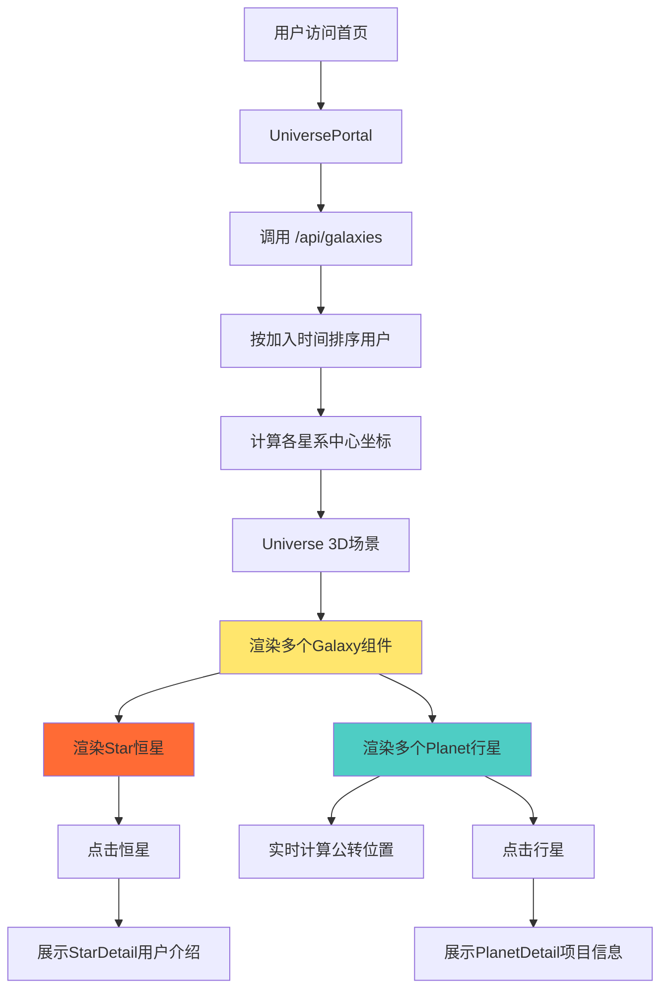

# 规划蓝图：AI宇宙星系系统实现
*   **状态**: [规划中]

## 1. 核心目标与验收标准 (Core Objective & Acceptance Criteria)

### a. 核心目标 (Core Objective)
为AI宇宙增加星系概念，实现多用户星系共存、智能布局算法、恒星-行星公转机制，以及用户个人介绍卡片系统，打造一个可扩展的、层次化的3D宇宙展示门户。

### b. 验收标准 (Acceptance Criteria)
*   `[ ]` 数据模型层：
    *   `[ ]` 扩展数据库schema，支持星系(Galaxy)、恒星项目(Star Project)、行星项目(Planet Project)的区分
    *   `[ ]` 支持用户个人介绍卡片数据的存储和管理
    *   `[ ]` 支持星系空间坐标、用户加入时间等元数据
*   `[ ]` 算法层：
    *   `[ ]` 实现星系不重叠布局算法（基于用户加入时间的空间分布）
    *   `[ ]` 实现同一用户多个项目的星系内部布局算法
    *   `[ ]` 实现行星围绕恒星的公转轨道计算
*   `[ ]` 视觉层：
    *   `[ ]` 恒星项目使用独特的视觉效果（如更大尺寸、发光效果、光晕）
    *   `[ ]` 行星项目围绕恒星公转，具备轨道可视化
    *   `[ ]` 星系之间有视觉边界或区域标识
*   `[ ]` 交互层：
    *   `[ ]` 用户可选择创建恒星项目（个人介绍卡片）
    *   `[ ]` 用户可创建普通AI项目，自动作为行星围绕其恒星
    *   `[ ]` 点击恒星展示用户个人介绍信息
    *   `[ ]` 点击行星展示项目详细信息
*   `[ ]` 数据真实性：
    *   `[ ]` 所有星系数据来自真实的数据库查询
    *   `[ ]` 所有坐标计算基于真实的用户和项目数据
    *   `[ ]` 无任何硬编码的模拟数据

## 2. 现状分析与复用性尽职调查 (Current State Analysis & Reuse Due Diligence)

### a. 复用性尽职调查

**搜索关键词**: `galaxy`, `star`, `orbit`, `solar system`, `user`, `project`, `position`, `layout`

**搜索范围**: `client/src/`, `client/prisma/`

**发现与结论**:
1. **现有Project模型**:
   - 已有基础的Project模型（包含id、title、description、category等）
   - 项目都是平级展示，没有层次关系
   - 缺少星系、恒星/行星的类型区分
   - 缺少空间位置坐标的持久化

2. **现有3D布局算法** (UniversePortal.tsx):
   - 使用黄金角度(137.5°)和球面均匀分布算法
   - 所有项目都是独立的"星球"，无分组概念
   - 坐标是运行时动态计算，未持久化
   - 可复用其球面分布逻辑，但需扩展为星系级别

3. **现有Planet组件**:
   - 已实现星球的纹理生成、自转、悬停效果
   - 可复用为行星组件
   - 需创建新的Star组件用于恒星展示

**结论**: 
- 现有的Project模型和Planet组件可作为基础进行扩展
- 需要新增Galaxy概念和Star/Planet区分
- 布局算法需要重构为两层：星系级别布局 + 星系内部布局
- **决策**: 扩展现有架构，而非全部重建

### b. 潜在影响分析
1. **数据库架构变更**:
   - 需要migration来扩展Project模型
   - 可能影响现有的seed数据
   - 需要数据迁移策略（将现有项目归属到各自的星系）

2. **API接口变更**:
   - `/api/projects/public` 需要返回星系分组数据
   - 可能需要新增 `/api/galaxy/:userId` 接口

3. **3D渲染性能**:
   - 星系概念会增加场景复杂度（恒星+多个行星+轨道线）
   - 需要考虑LOD（细节层次）优化
   - 可能需要实现视锥剔除(Frustum Culling)

## 3. 技术方案与架构设计 (Technical Approach & Architecture Design)

### a. 数据模型设计

#### Prisma Schema扩展

```prisma
// 项目类型枚举
enum ProjectType {
  STAR      // 恒星项目（用户个人介绍）
  PLANET    // 行星项目（AI工具）
}

// 扩展Project模型
model Project {
  id            String      @id @default(cuid())
  title         String
  description   String
  category      String
  tags          String[]
  
  // [新增] 星系相关字段
  projectType   ProjectType @default(PLANET)  // 项目类型
  isStarProject Boolean     @default(false)   // 是否为恒星项目
  
  // [新增] 个人介绍卡片字段（仅恒星项目使用）
  userBio       String?                       // 用户简介
  userTitle     String?                       // 用户头衔
  userSkills    String[]    @default([])      // 用户技能标签
  socialLinks   Json?                         // 社交链接 {github, linkedin, twitter, etc.}
  
  // [新增] 空间坐标（持久化，避免每次计算）
  galaxyX       Float?                        // 星系中心X坐标
  galaxyY       Float?                        // 星系中心Y坐标
  galaxyZ       Float?                        // 星系中心Z坐标
  orbitRadius   Float?                        // 行星轨道半径
  orbitAngle    Float?                        // 行星轨道角度
  
  // 现有字段...
  demoUrl       String?
  githubUrl     String?
  imageUrl      String?
  isActive      Boolean     @default(true)
  viewCount     Int         @default(0)
  likeCount     Int         @default(0)
  createdAt     DateTime    @default(now())
  updatedAt     DateTime    @updatedAt
  
  authorId      String
  author        User        @relation(fields: [authorId], references: [id], onDelete: Cascade)
  
  @@unique([title, authorId])
  @@map("projects")
}

// 扩展User模型
model User {
  id            String    @id @default(cuid())
  email         String    @unique
  name          String?
  password      String
  role          Role      @default(USER)
  avatar        String?
  
  // [新增] 星系相关字段
  galaxyJoinedAt DateTime  @default(now())   // 加入AI宇宙的时间（用于星系排序）
  galaxyX        Float?                      // 星系中心X坐标（持久化）
  galaxyY        Float?                      // 星系中心Y坐标
  galaxyZ        Float?                      // 星系中心Z坐标
  
  createdAt     DateTime  @default(now())
  updatedAt     DateTime  @updatedAt
  
  projects      Project[]
  sessions      Session[]
  accounts      Account[]
  
  @@map("users")
}
```

### b. 星系布局算法设计

#### 层次1：星系级别布局（用户之间的星系分布）

**目标**: 不同用户的星系在3D空间中不重叠，按加入时间临近展示

**算法**: 螺旋星系分布算法 (Spiral Galaxy Distribution)

```typescript
/**
 * 计算用户星系的3D坐标
 * 基于用户加入时间，使用阿基米德螺旋线在3D球面上分布
 */
function calculateGalaxyPosition(userIndex: number, totalUsers: number): [number, number, number] {
  const baseRadius = 20;  // 基础半径
  const spiralGrowth = 3; // 螺旋增长系数
  const verticalSpread = 10; // 垂直分布范围
  
  // 阿基米德螺旋: r = a + b * θ
  const theta = userIndex * (Math.PI * 2 / 5); // 每5个用户转一圈
  const radius = baseRadius + spiralGrowth * userIndex;
  
  // 3D坐标
  const x = radius * Math.cos(theta);
  const z = radius * Math.sin(theta);
  const y = (userIndex % 3 - 1) * verticalSpread; // 三层垂直分布
  
  return [x, y, z];
}
```

**星系安全距离检查**:
```typescript
const MIN_GALAXY_DISTANCE = 15; // 最小星系间距

function checkGalaxyOverlap(pos1: [number, number, number], pos2: [number, number, number]): boolean {
  const [x1, y1, z1] = pos1;
  const [x2, y2, z2] = pos2;
  const distance = Math.sqrt(
    Math.pow(x2 - x1, 2) + 
    Math.pow(y2 - y1, 2) + 
    Math.pow(z2 - z1, 2)
  );
  return distance < MIN_GALAXY_DISTANCE;
}
```

#### 层次2：星系内部布局（用户项目的恒星-行星系统）

**架构**: 每个用户的星系包含：
- **1个恒星**（用户个人介绍卡片，位于星系中心）
- **N个行星**（用户的AI项目，围绕恒星公转）

**行星轨道计算**:
```typescript
/**
 * 计算行星的轨道参数
 */
function calculatePlanetOrbit(planetIndex: number, totalPlanets: number) {
  const baseOrbitRadius = 3;  // 第一个行星的轨道半径
  const orbitGap = 1.5;        // 轨道间距
  
  // 轨道半径：从内到外递增
  const orbitRadius = baseOrbitRadius + planetIndex * orbitGap;
  
  // 初始角度：均匀分布
  const initialAngle = (planetIndex * 360 / totalPlanets) * (Math.PI / 180);
  
  // 公转速度：内圈快，外圈慢（开普勒第三定律的简化）
  const orbitSpeed = 0.2 / Math.sqrt(orbitRadius);
  
  return {
    radius: orbitRadius,
    initialAngle,
    speed: orbitSpeed
  };
}

/**
 * 实时计算行星位置（基于时间）
 */
function calculatePlanetPosition(
  galaxyCenter: [number, number, number],
  orbitRadius: number,
  initialAngle: number,
  orbitSpeed: number,
  elapsedTime: number
): [number, number, number] {
  const [gx, gy, gz] = galaxyCenter;
  
  // 当前角度 = 初始角度 + 速度 * 时间
  const currentAngle = initialAngle + orbitSpeed * elapsedTime;
  
  // 在XZ平面上公转
  const x = gx + orbitRadius * Math.cos(currentAngle);
  const z = gz + orbitRadius * Math.sin(currentAngle);
  const y = gy; // Y轴保持不变（可加入轻微波动）
  
  return [x, y, z];
}
```

### c. 视觉设计方案

#### 恒星视觉特征
1. **尺寸**: 比普通行星大1.5-2倍
2. **材质**: 
   - 高emissive强度（自发光）
   - 渐变色（暖色调：金黄/橙红）
   - 光晕效果（Bloom后处理）
3. **特效**:
   - 脉动动画（呼吸效果）
   - 光芒四射粒子
   - 强烈的边缘光（Rim Light）

#### 行星视觉特征
1. **尺寸**: 根据项目热度动态调整（0.8-1.2倍）
2. **材质**: 保持现有的程序化纹理
3. **新增**: 轨道线可视化
   - 使用虚线圆环
   - 半透明（opacity: 0.2-0.3）
   - 与行星颜色相匹配

#### 星系边界视觉
1. **方案A**: 半透明球形包围盒
2. **方案B**: 地板网格投影（更明显的区域划分）
3. **推荐**: 方案B + 用户名称标签

### d. 组件架构设计

```
components/
├── 3d/
│   ├── Universe.tsx           [修改] 整合星系布局
│   ├── Galaxy.tsx             [新建] 星系容器组件
│   ├── Star.tsx               [新建] 恒星组件
│   ├── Planet.tsx             [复用] 行星组件
│   ├── OrbitRing.tsx          [新建] 轨道线组件
│   └── GalaxyLabel.tsx        [新建] 星系标签组件
└── portal/
    ├── UniversePortal.tsx     [修改] 数据获取和星系管理
    ├── StarDetail.tsx         [新建] 恒星详情卡片（个人介绍）
    └── PlanetDetail.tsx       [复用] 行星详情卡片
```

### e. API接口设计

#### 1. 获取星系列表
```typescript
// GET /api/galaxies
// 返回所有用户的星系数据（用户+其恒星+行星列表）
{
  galaxies: [
    {
      userId: "user1",
      userName: "张三",
      userAvatar: "...",
      galaxyCenter: [10, 0, 5],
      joinedAt: "2025-01-01T00:00:00Z",
      star: {
        id: "star1",
        title: "张三的个人介绍",
        userBio: "全栈开发工程师...",
        userTitle: "高级工程师",
        userSkills: ["React", "Node.js"],
        socialLinks: {...}
      },
      planets: [
        {
          id: "planet1",
          title: "项目A",
          category: "文本处理",
          orbitRadius: 3,
          orbitAngle: 0,
          orbitSpeed: 0.2,
          ...
        }
      ]
    }
  ]
}
```

#### 2. 创建/更新恒星项目
```typescript
// POST /api/projects/star
{
  title: "用户姓名",
  userBio: "个人简介",
  userTitle: "职位头衔",
  userSkills: ["技能1", "技能2"],
  socialLinks: {
    github: "https://github.com/...",
    linkedin: "...",
    twitter: "..."
  }
}
```

### f. 架构图



## 4. 任务分解与上下文锚点 (Task Breakdown & Context Anchors)

### 里程碑1: 数据模型与数据库迁移 (状态: `未开始`)
*   `[ ]` 1.1: 扩展 Prisma Schema
    - 添加ProjectType枚举
    - 为Project添加星系相关字段
    - 为User添加galaxyJoinedAt等字段
*   `[ ]` 1.2: 生成并执行数据库迁移
    - `npx prisma migrate dev --name add_galaxy_system`
*   `[ ]` 1.3: 更新seed脚本
    - 为现有用户分配星系坐标
    - 为每个用户创建一个恒星项目
    - 更新现有项目为行星类型
*   `[ ]` 1.4: **(验证点)** 使用Prisma Studio验证数据结构

### 里程碑2: 后端API实现 (状态: `未开始`)
*   `[ ]` 2.1: 实现星系布局算法
    - 创建 `lib/galaxy/layout.ts` 工具函数
    - 实现 `calculateGalaxyPosition`
    - 实现 `calculatePlanetOrbit`
*   `[ ]` 2.2: 创建 `/api/galaxies` 接口
    - 查询所有用户及其项目
    - 计算/返回星系数据结构
*   `[ ]` 2.3: 创建 `/api/projects/star` 接口
    - 处理恒星项目的创建/更新
*   `[ ]` 2.4: **(验证点)** Postman/Thunder Client测试所有API

### 里程碑3: 3D组件开发 (状态: `未开始`)
*   `[ ]` 3.1: 创建Star恒星组件
    - 独特的视觉效果（大尺寸、高发光）
    - 脉动动画
*   `[ ]` 3.2: 创建OrbitRing轨道线组件
    - 虚线圆环绘制
    - 半透明材质
*   `[ ]` 3.3: 创建Galaxy容器组件
    - 管理一个星系内的所有天体
    - 实时计算行星公转
*   `[ ]` 3.4: 修改Universe场景
    - 渲染多个Galaxy实例
    - 相机控制优化
*   `[ ]` 3.5: **(验证点)** 本地测试3D渲染效果

### 里程碑4: UI交互层 (状态: `未开始`)
*   `[ ]` 4.1: 创建StarDetail组件
    - 展示用户个人介绍
    - 展示社交链接
    - 科幻风格卡片设计
*   `[ ]` 4.2: 更新UniversePortal
    - 集成 `/api/galaxies` 数据
    - 处理恒星和行星的点击事件
*   `[ ]` 4.3: 创建/编辑恒星项目的UI流程
    - 在Dashboard添加"创建个人介绍"入口
    - 创建StarForm表单组件
*   `[ ]` 4.4: **(验证点)** 完整用户流程测试

### 里程碑5: 性能优化与测试 (状态: `未开始`)
*   `[ ]` 5.1: 性能优化
    - 实现LOD（远处星系简化渲染）
    - 优化公转计算（requestAnimationFrame）
*   `[ ]` 5.2: 响应式设计
    - 移动端触摸优化
    - 低配设备降级方案
*   `[ ]` 5.3: 完整的端到端测试
*   `[ ]` 5.4: **(验证点)** 性能分析报告

## 5. 风险评估与应对策略 (Risk Assessment & Mitigation Plan)

### 风险1: 数据库迁移可能影响现有数据
**风险等级**: 🟡 中等

**影响**: 如果迁移失败，可能导致现有项目数据丢失或不可用

**应对策略**:
1. 迁移前完整备份数据库
2. 先在开发环境充分测试迁移脚本
3. 编写数据回滚脚本
4. 使用Prisma的shadow database特性

### 风险2: 3D渲染性能问题
**风险等级**: 🟠 高

**影响**: 当用户和项目数量增多时，可能导致渲染卡顿

**应对策略**:
1. 实现LOD系统（距离过远的星系使用简化模型）
2. 使用Three.js的InstancedMesh批量渲染相似物体
3. 实现视锥剔除，只渲染可见的星系
4. 提供"性能模式"选项（减少粒子特效）
5. 设置最大同时渲染星系数量（如20个），超出部分分页加载

### 风险3: 用户没有恒星项目的处理
**风险等级**: 🟢 低

**影响**: 新用户如果不创建恒星项目，其星系可能显示不完整

**应对策略**:
1. 用户注册时自动创建默认恒星项目（使用基础信息）
2. 引导流程：首次登录提示完善个人介绍
3. 如无恒星项目，星系中心显示占位符（待激活状态）

### 风险4: 星系坐标冲突
**风险等级**: 🟡 中等

**影响**: 算法可能无法完美保证所有星系不重叠

**应对策略**:
1. 在API层增加冲突检测和自动调整逻辑
2. 使用物理引擎进行碰撞检测和位置微调
3. 定期运行后台任务重新优化星系布局

### 风险5: 复杂度导致开发周期延长
**风险等级**: 🟠 高

**影响**: 功能复杂，可能超出预期开发时间

**应对策略**:
1. MVP优先：先实现核心功能（星系布局+基础公转）
2. 视觉效果可分阶段优化（V1简单，V2精致）
3. 可选功能后置（如星系边界可视化、高级粒子特效等）

---

**蓝图创建时间**: 2025-10-19 11:51:53
**预计开发周期**: 5-7个工作日
**优先级**: 🔴 高（核心功能扩展）

