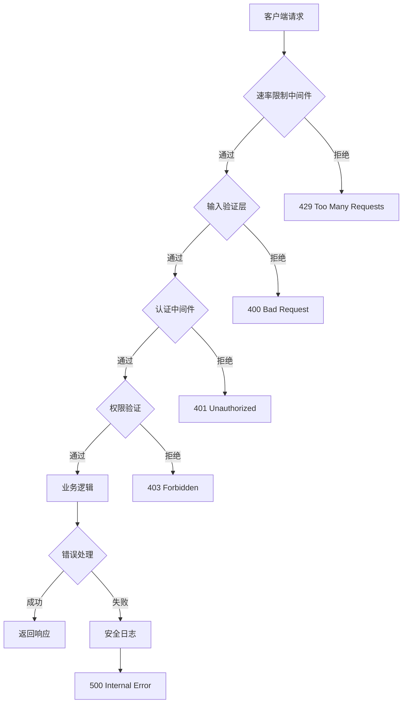

# 规划蓝图: HOMELABS Portal - 生产部署安全加固

*   **状态**: [进行中]
*   **创建时间**: 2025-10-19 18:02:34
*   **优先级**: 🔴 最高 (部署阻塞)

---

## 1. 核心目标与验收标准 (Core Objective & Acceptance Criteria)

### a. 核心目标 (Core Objective)
将HOMELABS Portal项目从当前的"中等风险"状态提升至"生产级高安全"标准,消除所有高危和中危安全隐患,确保项目可以安全地部署到生产环境。

### b. 验收标准 (Acceptance Criteria)
*   `[ ]` **Phase 1完成**: 所有5个高危安全问题已修复并通过验证
*   `[ ]` **Phase 2完成**: 所有6个中危安全问题已修复并通过验证
*   `[ ]` **环境安全**: .env文件已正确配置且未泄露到Git
*   `[ ]` **密码安全**: 弱密码无法通过注册,强密码策略生效
*   `[ ]` **API安全**: 速率限制生效,暴力破解尝试被阻止
*   `[ ]` **代码质量**: 通过安全代码扫描(npm audit),无高危漏洞
*   `[ ]` **功能验证**: 所有现有功能在安全加固后仍正常工作
*   `[ ]` **文档更新**: 部署文档已更新,包含所有新的安全配置说明

---

## 2. 现状分析与复用性尽职调查 (Current State Analysis & Reuse Due Diligence)

### a. 当前安全状态
根据安全审计报告,项目存在以下核心问题:

**高危问题 (5个)**:
1. 环境变量文件可能泄露到Git
2. 弱密码策略(仅前端验证)
3. 使用示例密钥(NEXTAUTH_SECRET)
4. 缺少NEXTAUTH_URL配置
5. 密码字段查询风险

**中危问题 (6个)**:
6. 缺少API速率限制
7. 缺少CORS配置
8. 错误信息过于详细
9. 缺少输入数据长度限制
10. 缺少邮箱格式验证
11. Session过期时间未配置

### b. 复用性尽职调查

**搜索关键词**: `ratelimit`, `validation`, `security`, `helmet`, `cors`  
**搜索范围**: `client/src/`, `package.json`

**发现与结论**:
- ✅ 已使用 `bcryptjs` 进行密码加密
- ✅ 已使用 `NextAuth.js` 认证框架
- ❌ **未发现**: 速率限制库
- ❌ **未发现**: 输入验证库
- ❌ **未发现**: 安全头管理库
- ❌ **未发现**: 结构化日志系统

**结论**: 需要引入新的安全依赖库,但核心认证框架可复用。

### c. 潜在影响分析
- **破坏性风险**: 🟢 低 - 主要是新增验证逻辑,不改变现有业务流程
- **性能影响**: 🟡 中 - 速率限制会增加轻微延迟(~1-5ms)
- **用户体验**: 🟡 中 - 更严格的密码策略可能需要用户修改密码
- **开发工作量**: 🟡 中 - 预计需要4-6小时完成核心修复

---

## 3. 技术方案与架构设计 (Technical Approach & Architecture Design)

### A. 依赖项管理策略

#### 新增安全依赖
```json
{
  "@upstash/ratelimit": "^1.0.0",      // API速率限制
  "@upstash/redis": "^1.28.4",         // Redis支持(速率限制后端)
  "password-validator": "^5.3.0",       // 密码强度验证
  "zod": "^3.22.4",                     // 输入验证
  "winston": "^3.11.0",                 // 结构化日志
  "winston-daily-rotate-file": "^4.7.1" // 日志轮转
}
```

#### 依赖选型理由
- **@upstash/ratelimit**: 
  - 优势: 无服务器友好,支持多种算法,零配置Redis
  - 替代方案: express-rate-limit (需要Redis配置)
  
- **zod**: 
  - 优势: TypeScript原生支持,类型推导,性能优秀
  - 替代方案: joi, yup (类型支持较弱)
  
- **winston**: 
  - 优势: 生产级日志,支持多传输,结构化日志
  - 替代方案: pino (更轻量但功能较少)

### B. 安全加固架构



### C. 关键模块设计

#### 1. 统一验证中间件 (lib/validation.ts)
```typescript
import { z } from 'zod';

// 密码验证Schema
export const passwordSchema = z.string()
  .min(8, "密码至少8位")
  .max(100, "密码最多100位")
  .regex(/[A-Z]/, "密码必须包含大写字母")
  .regex(/[a-z]/, "密码必须包含小写字母")
  .regex(/[0-9]/, "密码必须包含数字");

// 邮箱验证Schema
export const emailSchema = z.string()
  .email("邮箱格式不正确")
  .max(255, "邮箱地址过长");

// 注册请求验证
export const registerSchema = z.object({
  email: emailSchema,
  password: passwordSchema,
  name: z.string().min(1).max(100),
});
```

#### 2. 速率限制服务 (lib/ratelimit.ts)
```typescript
import { Ratelimit } from "@upstash/ratelimit";
import { Redis } from "@upstash/redis";

// 配置多种限流策略
export const loginRateLimit = new Ratelimit({
  redis: Redis.fromEnv(),
  limiter: Ratelimit.slidingWindow(5, "1 m"), // 登录: 每分钟5次
  analytics: true,
});

export const registerRateLimit = new Ratelimit({
  redis: Redis.fromEnv(),
  limiter: Ratelimit.slidingWindow(3, "1 h"), // 注册: 每小时3次
});

export const apiRateLimit = new Ratelimit({
  redis: Redis.fromEnv(),
  limiter: Ratelimit.slidingWindow(100, "1 m"), // 通用API: 每分钟100次
});
```

#### 3. 安全日志系统 (lib/logger.ts)
```typescript
import winston from 'winston';
import DailyRotateFile from 'winston-daily-rotate-file';

const logger = winston.createLogger({
  level: process.env.LOG_LEVEL || 'info',
  format: winston.format.combine(
    winston.format.timestamp(),
    winston.format.errors({ stack: true }),
    winston.format.json()
  ),
  defaultMeta: { service: 'homelabs-portal' },
  transports: [
    new DailyRotateFile({
      filename: 'logs/error-%DATE%.log',
      datePattern: 'YYYY-MM-DD',
      level: 'error',
      maxFiles: '30d',
    }),
    new DailyRotateFile({
      filename: 'logs/combined-%DATE%.log',
      datePattern: 'YYYY-MM-DD',
      maxFiles: '30d',
    }),
  ],
});

// 开发环境输出到控制台
if (process.env.NODE_ENV !== 'production') {
  logger.add(new winston.transports.Console({
    format: winston.format.simple(),
  }));
}

export default logger;
```

---

## 4. 任务分解与上下文锚点 (Task Breakdown & Context Anchors)

### 🔴 Phase 1: 核心安全修复 (高危问题) - **部署阻塞**

#### 里程碑 1.1: 环境配置安全化
*   `[ ]` **1.1.1**: 审查Git历史,检查是否泄露环境变量
    - 命令: `git log --all --full-history -- "*.env*"`
    - 如有泄露: 使用 git-filter-repo 清理
*   `[ ]` **1.1.2**: 更新 .gitignore,确保所有环境变量文件被排除
    - 添加: `.env`, `.env.local`, `.env*.local`
*   `[ ]` **1.1.3**: 生成强随机NEXTAUTH_SECRET
    - 命令: `openssl rand -base64 32`
    - 更新所有环境配置文件
*   `[ ]` **1.1.4**: 配置 NEXTAUTH_URL 环境变量
    - 开发: `http://localhost:3000`
    - 生产: `https://yourdomain.com`
*   `[ ]` **[验证点]**: 运行 `git status` 确认无敏感文件暴露

#### 里程碑 1.2: 密码安全加固
*   `[ ]` **1.2.1**: 安装密码验证依赖
    - `npm install zod password-validator`
*   `[ ]` **1.2.2**: 创建 `lib/validation.ts` 统一验证模块
*   `[ ]` **1.2.3**: 更新注册API,添加后端密码强度验证
    - 文件: `src/app/api/auth/register/route.ts`
*   `[ ]` **1.2.4**: 更新前端注册表单,同步密码规则提示
    - 文件: `src/app/auth/signup/page.tsx`
*   `[ ]` **[验证点]**: 测试弱密码("123456")被拒绝

#### 里程碑 1.3: 敏感数据保护
*   `[ ]` **1.3.1**: 创建 `lib/select.ts` 统一数据选择器
*   `[ ]` **1.3.2**: 实现 `userSelectPublic` 选择器(显式排除password)
*   `[ ]` **1.3.3**: 审查所有用户查询API,应用安全选择器
    - 文件: `api/admin/users/route.ts`
    - 文件: `api/projects/route.ts`
    - 文件: `api/galaxies/route.ts`
*   `[ ]` **[验证点]**: API响应中不包含password字段

---

### 🟡 Phase 2: API安全加固 (中危问题) - **部署前必须完成**

#### 里程碑 2.1: 速率限制系统
*   `[ ]` **2.1.1**: 注册Upstash账号,获取Redis连接信息
*   `[ ]` **2.1.2**: 安装依赖: `npm install @upstash/ratelimit @upstash/redis`
*   `[ ]` **2.1.3**: 配置环境变量
    - `UPSTASH_REDIS_REST_URL`
    - `UPSTASH_REDIS_REST_TOKEN`
*   `[ ]` **2.1.4**: 创建 `lib/ratelimit.ts` 速率限制服务
*   `[ ]` **2.1.5**: 为登录API添加速率限制
    - 文件: `src/lib/auth.ts` (authorize函数)
*   `[ ]` **2.1.6**: 为注册API添加速率限制
    - 文件: `src/app/api/auth/register/route.ts`
*   `[ ]` **2.1.7**: 为敏感管理API添加速率限制
    - 文件: `api/admin/users/route.ts`
    - 文件: `api/admin/projects/route.ts`
*   `[ ]` **[验证点]**: 快速连续请求10次登录,第6次被拒绝(429)

#### 里程碑 2.2: 输入验证加固
*   `[ ]` **2.2.1**: 扩展 `lib/validation.ts`,添加所有输入Schema
    - 邮箱验证 + 长度限制
    - 项目标题/描述长度限制
    - URL格式验证
*   `[ ]` **2.2.2**: 更新注册API,使用zod验证
*   `[ ]` **2.2.3**: 更新项目创建API,添加完整验证
    - 文件: `api/projects/route.ts` (POST方法)
*   `[ ]` **2.2.4**: 更新项目编辑API,添加完整验证
    - 文件: `api/projects/[id]/route.ts` (PUT方法)
*   `[ ]` **[验证点]**: 提交超长描述(>5000字)被拒绝

#### 里程碑 2.3: 安全配置增强
*   `[ ]` **2.3.1**: 更新 `lib/auth.ts`,配置Session过期时间
    - JWT maxAge: 7天
    - Session maxAge: 7天
*   `[ ]` **2.3.2**: 更新 `next.config.ts`,添加CORS和安全头
*   `[ ]` **2.3.3**: 安装日志库: `npm install winston winston-daily-rotate-file`
*   `[ ]` **2.3.4**: 创建 `lib/logger.ts` 日志系统
*   `[ ]` **2.3.5**: 替换所有API中的console.error为logger.error
*   `[ ]` **[验证点]**: 日志文件正确生成到 logs/ 目录

---

### 🟢 Phase 3: 生产优化 (低危问题) - **部署后尽快完成**

#### 里程碑 3.1: Nginx安全增强
*   `[ ]` **3.1.1**: 更新 `docker/nginx.conf`,添加完整CSP头
*   `[ ]` **3.1.2**: 添加其他安全头:
    - `Strict-Transport-Security`
    - `Permissions-Policy`
*   `[ ]` **[验证点]**: 浏览器开发工具验证安全头存在

#### 里程碑 3.2: 监控与健康检查
*   `[ ]` **3.2.1**: 创建 `api/health/route.ts` 健康检查端点
*   `[ ]` **3.2.2**: 实现数据库连接检查
*   `[ ]` **3.2.3**: 实现Redis连接检查(如果使用)
*   `[ ]` **[验证点]**: `curl /api/health` 返回200

#### 里程碑 3.3: 数据库优化
*   `[ ]` **3.3.1**: 更新DATABASE_URL,添加连接池参数
    - `connection_limit=10`
    - `pool_timeout=20`
*   `[ ]` **[验证点]**: Prisma连接池正常工作

---

## 5. 风险评估与应对策略 (Risk Assessment & Mitigation Plan)

### 技术风险

#### 风险1: Upstash Redis服务不稳定
**概率**: 🟡 中  
**影响**: 速率限制失效,API易受攻击  
**应对策略**:
- 备选方案: 使用本地Redis容器(Docker Compose)
- 降级策略: 实现基于内存的简单速率限制(单节点可用)
- 监控告警: 配置Upstash服务监控

#### 风险2: 更严格的密码策略导致用户流失
**概率**: 🟢 低  
**影响**: 新用户注册失败率上升  
**应对策略**:
- 提供清晰的密码要求提示
- 实现密码强度实时显示
- 考虑密码找回功能增强

#### 风险3: 速率限制误伤正常用户
**概率**: 🟡 中  
**影响**: 合法用户被暂时封禁  
**应对策略**:
- 为管理员提供解封功能
- 记录被限流的IP和时间,便于分析
- 提供友好的错误提示,告知用户等待时间

### 业务风险

#### 风险4: 现有用户密码不符合新策略
**概率**: 🟡 中  
**影响**: 老用户无法继续使用原密码  
**应对策略**:
- **不强制修改**: 新策略仅适用于注册和修改密码
- 发送邮件通知,建议用户更新密码
- 提供密码修改功能入口

---

## 6. 测试与验证计划 (Testing & Validation Plan)

### Phase 1 验证清单
- [ ] Git历史无敏感信息泄露
- [ ] 弱密码(123456, password)注册失败
- [ ] 强密码(Abc12345!)注册成功
- [ ] API响应不包含password字段
- [ ] Session在7天后自动过期

### Phase 2 验证清单
- [ ] 登录API: 1分钟内第6次请求被限流
- [ ] 注册API: 1小时内第4次请求被限流
- [ ] 邮箱格式错误被拒绝
- [ ] 超长输入(>5000字)被拒绝
- [ ] 错误日志正确写入文件,不暴露给客户端

### Phase 3 验证清单
- [ ] `/api/health` 返回数据库连接状态
- [ ] 浏览器显示CSP头
- [ ] Prisma连接池参数生效

### 渗透测试建议
```bash
# 1. 暴力破解测试
for i in {1..10}; do
  curl -X POST http://localhost:3000/api/auth/signin \
    -H "Content-Type: application/json" \
    -d '{"email":"test@test.com","password":"wrong"}'
done
# 预期: 第6次返回429

# 2. SQL注入测试
curl -X POST http://localhost:3000/api/auth/register \
  -H "Content-Type: application/json" \
  -d '{"email":"test@test.com","password":"pass' OR '1'='1","name":"test"}'
# 预期: 被Prisma安全阻止或被zod验证拒绝

# 3. XSS测试
curl -X POST http://localhost:3000/api/projects \
  -H "Content-Type: application/json" \
  -d '{"title":"<script>alert(1)</script>","description":"test"}'
# 预期: React自动转义,不执行脚本
```

---

## 7. 部署与回滚策略 (Deployment & Rollback Strategy)

### 部署流程
1. **准备阶段**:
   - 备份当前生产数据库
   - 记录当前Git commit hash
   - 准备回滚脚本

2. **灰度发布**:
   - 先部署到测试环境验证
   - 部署到生产环境(10%流量)
   - 监控错误率和性能指标
   - 逐步扩大到100%流量

3. **监控指标**:
   - API响应时间(<200ms)
   - 错误率(<0.1%)
   - 速率限制触发次数
   - 日志异常数量

### 回滚触发条件
- 错误率 > 1%
- API响应时间 > 500ms
- 用户投诉激增
- 速率限制误伤率 > 5%

### 回滚步骤
```bash
# 1. 回滚代码
git revert <commit-hash> --no-edit
git push origin main

# 2. 回滚数据库(如有Schema变更)
npx prisma migrate resolve --rolled-back <migration-name>

# 3. 重启服务
docker-compose restart app

# 4. 通知团队
echo "已回滚到版本: <previous-version>"
```

---

## 8. 文档更新计划 (Documentation Update Plan)

### 需要更新的文档
*   `[ ]` `README.md`: 添加新的环境变量说明
*   `[ ]` `docs/DEPLOYMENT.md`: 更新生产部署流程
*   `[ ]` `client/.env.example`: 添加Redis配置模板
*   `[ ]` 新建 `docs/SECURITY.md`: 安全最佳实践指南

### 安全文档内容大纲
1. 密码策略说明
2. API速率限制规则
3. 环境变量管理规范
4. 日志和监控配置
5. 安全事件响应流程

---

## 9. 成本与资源评估 (Cost & Resource Estimation)

### 开发工时估算
| 阶段 | 任务 | 预计工时 |
|------|------|---------|
| Phase 1 | 环境配置安全化 | 1h |
| Phase 1 | 密码安全加固 | 1.5h |
| Phase 1 | 敏感数据保护 | 1h |
| Phase 2 | 速率限制系统 | 2h |
| Phase 2 | 输入验证加固 | 1.5h |
| Phase 2 | 安全配置增强 | 1h |
| Phase 3 | Nginx安全增强 | 0.5h |
| Phase 3 | 监控与健康检查 | 1h |
| Phase 3 | 数据库优化 | 0.5h |
| 测试与验证 | 全面测试 | 2h |
| **总计** | | **12h** |

### 基础设施成本
- **Upstash Redis**: $0-10/月 (取决于流量)
- **日志存储**: 本地磁盘(10GB预留)
- **SSL证书**: $0 (使用Let's Encrypt)

---

## 10. 最后的提醒 (Final Reminders)

### 🚨 绝对禁止的操作
1. ❌ 在未完成Phase 1的情况下部署到生产
2. ❌ 使用硬编码的密钥或密码
3. ❌ 绕过速率限制进行测试后忘记恢复
4. ❌ 在生产环境使用 `NODE_ENV=development`

### ✅ 强制执行的操作
1. ✅ 每次代码提交前运行 `npm audit`
2. ✅ 生产部署前完整执行所有验证清单
3. ✅ 保持至少3天的备份
4. ✅ 配置错误告警通知

---

**蓝图负责人**: AI安全工程师  
**预计完成时间**: 2025-10-20  
**下次审查时间**: 完成Phase 1后

---

*本蓝图将持续更新,直到所有安全问题得到解决并成功部署到生产环境。*

